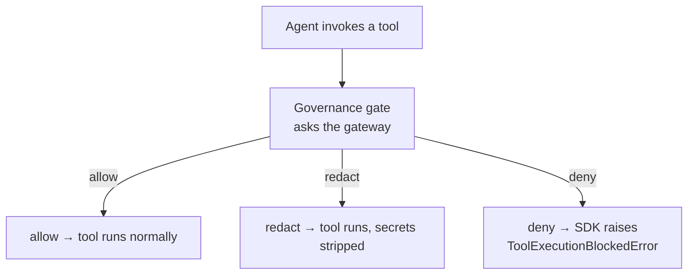

# Handling allow/deny decisions

When the gateway **denies** a tool call, the SDK raises an exception at the point where the
tool would have run. This guide shows how to catch those decisions, which exception to catch,
and how to test a policy without actually blocking anything.

## The decision flow

Every governed tool call goes through the gate before it executes:



A `deny` surfaces in your code as a raised exception; `allow` and `redact` let the call
proceed (with redaction applied for the latter). So "handling a deny" is ordinary Python
exception handling.

## The exception hierarchy

Every error the SDK raises inherits from `agent_assembly.AssemblyError`, so a single
`except AssemblyError:` is a safe backstop. The tree:

```text
AssemblyError                       (base — catches everything from the SDK)
├── AgentError                      (agent registration / lifecycle)
├── PolicyError                     (policy evaluation problems)
├── GatewayError                    (network / HTTP transport to the gateway)
├── ConfigurationError              (bad init_assembly() arguments)
├── AdapterValidationError          (an adapter violated the FrameworkAdapter contract)
├── OpTerminatedError               (the gateway terminated an in-flight op)
└── ToolExecutionBlockedError       (a tool call was blocked by governance)
    ├── MCPToolBlockedError         (an MCP tool call was blocked)
    └── PolicyViolationError        (policy denied a tool call)
```

The key node for decision handling is **`ToolExecutionBlockedError`**. Both
`MCPToolBlockedError` and `PolicyViolationError` derive from it, so
`except ToolExecutionBlockedError:` catches **every** policy-blocked tool call regardless of
which framework or path raised it.

`MCPToolBlockedError` additionally carries `tool_name` and `server` attributes so you can tell
*which* MCP tool on *which* server was blocked.

!!! note "A block is not a bug"
    `ToolExecutionBlockedError` and its subtypes are not SDK failures — they mean the policy
    engine did its job and denied a call. Treat them as expected control flow, not as errors to
    suppress.

## Catching a denial

Catch the most specific exception you care about:

```python
from agent_assembly import init_assembly, ToolExecutionBlockedError

with init_assembly(
    gateway_url="http://localhost:7391",
    api_key="dev-key",
    agent_id="my-agent",
    mode="sdk-only",
):
    try:
        result = run_my_agent()  # somewhere inside, a governed tool call happens
    except ToolExecutionBlockedError as blocked:
        # The gateway denied a tool call. Decide what to do:
        #   - log it and continue with a fallback,
        #   - surface a friendly message to the user,
        #   - re-raise to fail the run.
        log.warning("tool call blocked by policy: %s", blocked)
        result = fallback_response()
```

To distinguish an MCP block specifically:

```python
from agent_assembly import MCPToolBlockedError, ToolExecutionBlockedError

try:
    run_my_agent()
except MCPToolBlockedError as blocked:
    log.warning("MCP tool %r on server %r blocked", blocked.tool_name, blocked.server)
except ToolExecutionBlockedError as blocked:
    log.warning("tool call blocked: %s", blocked)
```

## Seeing what *would* be blocked, without blocking

To roll out a policy safely, register the agent in **observe** (dry-run) mode. Every action
proceeds, but the gateway records would-be violations as shadow audit events — so nothing in
your agent raises, and you can review what the policy *would* have denied:

```python
with init_assembly(
    gateway_url="http://localhost:7391",
    api_key="dev-key",
    agent_id="my-agent",
    enforcement_mode="observe",  # dry-run: record, don't block
):
    run_my_agent()
```

Switch back to `enforcement_mode="enforce"` (or omit it — the gateway defaults to enforce) when
you're confident the policy is correct. See
[Core Concepts → Enforcement modes](../concepts/index.md#enforcement-modes).

## Other exceptions you may see

| Exception | When | What to do |
| --- | --- | --- |
| `ConfigurationError` | Bad `init_assembly()` arguments (unknown mode, missing gateway). | Fix the call; it's raised before any side effect. |
| `GatewayError` | The SDK reached the network but the gateway didn't answer. | Check the gateway is up and the URL/key are right. |
| `OpTerminatedError` | The gateway terminated an in-flight op; carries the originating `op_id`. | Correlate via `op_id`; the awaited operation was cancelled server-side. |

For message-by-message remedies, see [Troubleshooting](../troubleshooting.md).
