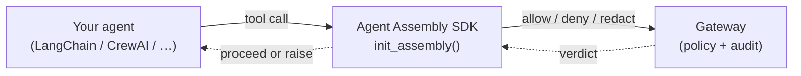

# Agent Assembly Python SDK

**In plain terms:** this SDK is how a Python agent asks for permission before it acts.
You wrap your existing agent in one `init_assembly()` call, and from that point on every
tool call your agent makes is checked against a governance policy — allowed, denied, or
recorded — without you rewriting a single line of the agent itself.

It is two things in one package:

- a **pure-Python client** that talks to the Agent Assembly **gateway** (the policy brain),
  and
- an **in-process governance shim** that quietly hooks into the agent framework you already
  use (LangChain, CrewAI, LangGraph, …) and routes its tool calls through that gateway.

You keep writing agents the way you always have. The SDK is the seatbelt you click in once.

> **New to Agent Assembly?** This SDK is one of three interception layers in the broader
> platform. For the product overview, the gateway, and the policy model, see the core
> [Agent Assembly documentation](https://ai-agent-assembly.github.io/agent-assembly/) and the
> [documentation hub](https://ai-agent-assembly.github.io/agent-assembly-docs/).

## What it wraps

The SDK does not replace your agent framework — it **intercepts** it. When you call
`init_assembly()`, the SDK detects which supported framework is importable in your process
and monkey-patches that framework's tool-call entry points so each call passes through a
policy gate first. Today it ships adapters for **LangChain, LangGraph, CrewAI, OpenAI Agents,
Pydantic AI, Google ADK, and MCP servers**.

## Who it's for

- **Developers** who want to add governance to an existing Python agent without re-architecting it.
- **Platform teams** standing up a policy gateway who need their agents to report to it.
- **Operators** who need an audit trail of every tool call, prompt, and policy decision.

## Why use it

- **Framework adapters** for LangChain, LangGraph, CrewAI, OpenAI Agents, Pydantic AI,
  Google ADK, and MCP servers — drop in, no agent rewrites required.
- **Pre-execution policy enforcement** — block disallowed tool calls *before* they run.
- **Audit trail** — every tool call, prompt, and policy decision is emitted to the gateway
  with full agent lineage (parent / root / team).
- **Native PyO3 fast path** (optional) — drop into a Rust runtime client when you need
  sub-millisecond policy checks.
- **Typed throughout** — typed models for every gateway payload; the package ships a
  `py.typed` marker so your own type checker understands the API.

## Where to go next

| If you want to… | Go to |
| --- | --- |
| Install and govern your first agent in 5 minutes | **[Quick Start](quick-start.md)** |
| Understand the adapter pattern, modes, and lifecycle | **[Core Concepts](concepts/index.md)** |
| See real framework integrations and decision handling | **[Guides](guides/framework-examples.md)** |
| Configure the gateway URL, API key, and modes | **[Configuration](configuration.md)** |
| Look up a class, exception, or model | **[API Reference](api-reference/index.md)** |
| Check Python / core-runtime compatibility and releases | **[Compatibility & Versioning](compatibility/index.md)** |
| Diagnose an error | **[Troubleshooting](troubleshooting.md)** |

## Project status

**Pre-1.0 (`0.x`) — published and usable, API not yet frozen.** The SDK is released to PyPI
from the `0.0.x` line. Until `1.0.0`, minor versions may introduce breaking changes to the
public surface; pin an exact version (`agent-assembly==0.0.x`) if you need a stable contract.
See [Compatibility & Versioning](compatibility/index.md) for the full policy.

## Versions

This site is published with [`mike`](https://github.com/jimporter/mike) — use the version
selector at the top of the page to switch between **stable** (the latest released version)
and **latest** (the head of `master`). Older versions remain accessible at their pinned URLs.
