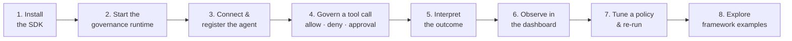

# Quick Start

Govern your first agent end-to-end in about ten minutes. By the end you will have stood up a
real governance runtime, connected an agent to it, watched the **same** tool call be **allowed**,
**denied**, and **held for approval** purely by changing policy, seen those decisions in the
operator dashboard, and tuned a policy and re-run — all on your own machine.

This page uses the current published pre-release, `{{ aa.python_sdk.package_name }}`
**`{{ aa.python_sdk.version }}`**. Every command and import below is real and runs against that
version.



## 1. Install

The package is published on PyPI as
[`{{ aa.python_sdk.package_name }}`]({{ aa.urls.pypi }}) (current version:
`{{ aa.python_sdk.version }}`).

=== "pip"

    ```bash
    {{ aa.commands.install_pip }}            # pure-Python SDK
    {{ aa.commands.install_pip_runtime }} # SDK + bundled aasm runtime binary (platform wheel)
    ```

=== "uv"

    ```bash
    {{ aa.commands.install_uv }}
    ```

=== "poetry"

    ```bash
    {{ aa.commands.install_poetry }}            # pure-Python SDK
    {{ aa.commands.install_poetry_runtime }} # SDK + bundled aasm runtime binary (platform wheel)
    ```

=== "conda"

    `{{ aa.python_sdk.package_name }}` is not published on conda-forge or the
    Anaconda default channel — create a conda environment, then install from
    PyPI with `pip` inside it:

    ```bash
    {{ aa.commands.install_conda }}
    {{ aa.commands.install_conda_pip }}
    ```

!!! note "`--pre` is required for now"
    Agent Assembly is currently published only as a pre-release on PyPI, and `pip`
    skips pre-releases unless you pass `--pre` (already included above). Drop the flag
    once a stable (non-pre-release) version is published.

`{{ aa.python_sdk.package_name }}` is the pure-Python client — everything in this guide imports
from it. Confirm the version you installed:

```bash
python -c "import agent_assembly; print(agent_assembly.__version__)"   # -> {{ aa.python_sdk.version }}
```

## 2. Start the governance runtime

The SDK is only the fast in-process layer — it is **not a security boundary on its own**. The
authoritative enforcement point is **`aa-runtime`**, a small sidecar that holds your policy and
answers every allow/deny/approval decision. Start it once and every governed call in the rest of
this guide is decided by it.

!!! info "What is open-source, and what is SaaS"
    You can self-host a **limited-function** stack from the published `aa-runtime` image: it
    enforces a **local policy file** with no central service, which is exactly what this
    quick-start uses. The full control plane — the central gateway brain, the populated HTTP/API,
    team budgets, and the *data* behind the operator dashboard — is delivered as SaaS. Everything
    below runs on the open-source `aa-runtime` alone.

First, write a policy. The runtime reads a TOML file; each `[[rules]]` block names the action
types it governs. Action strings match the wire protocol's `ActionType` enum
(`FILE_OPERATION`, `NETWORK_CALL`, `PROCESS_EXEC`, `TOOL_CALL`, `LLM_CALL`, `MEMORY_ACCESS`).
Anything **not** matched by a rule is allowed.

```toml title="policy.toml"
# Deny anything that writes files or executes code outright...
[[rules]]
name = "block-file-and-exec"
blocked_actions = ["FILE_OPERATION", "PROCESS_EXEC"]

# ...but hold outbound network calls for a human to approve.
[[rules]]
name = "gate-network-on-approval"
requires_approval_actions = ["NETWORK_CALL"]
approval_timeout_secs = 300
```

Now run the runtime, mounting that policy and a directory for its IPC socket. The image tag is
pinned to this release for reproducibility:

```bash
mkdir -p /tmp/aa-sock

docker run --rm \
  -e AA_AGENT_ID=quickstart-agent \
  -e AA_POLICY_PATH=/etc/aa/policy.toml \
  -v "$PWD/policy.toml":/etc/aa/policy.toml:ro \
  -v /tmp/aa-sock:/tmp \
  -p 8080:8080 \
  ghcr.io/ai-agent-assembly/aa-runtime:v0.0.1-rc.6
```

The runtime exposes a readiness probe and its IPC socket. Confirm it is up, then point the SDK
at the socket (the file name is `aa-runtime-<AA_AGENT_ID>.sock`):

```bash
curl -s http://localhost:8080/ready          # -> ok, once the runtime has loaded the policy
export AA_RUNTIME_SOCKET=/tmp/aa-sock/aa-runtime-quickstart-agent.sock
```

!!! tip "Prefer Docker Compose, or no container at all?"
    The core repo ships a ready-made [`examples/docker-compose`](https://github.com/ai-agent-assembly/agent-assembly/tree/master/examples/docker-compose)
    stack that wires the same `aa-runtime` sidecar to a stub agent over a shared socket volume —
    clone it and run `AA_API_KEY=dev-local-key docker compose up`. If you installed the
    `[runtime]` extra, you also have the `aasm` binary locally and can run the fuller gRPC
    gateway instead: `aasm gateway start --policy low-risk.yaml` (listens on
    `grpc://127.0.0.1:50051`). Both paths enforce the same policy semantics; this guide uses the
    container so no local build is required.

## 3. Connect and register your agent

`init_assembly()` is the one call that wires governance into your process — it registers the
agent with the runtime and installs the interceptor for whichever framework you use, so from
that point on tool calls are checked automatically. Import everything from the top-level
`agent_assembly` package:

```python
from agent_assembly import init_assembly

with init_assembly(
    agent_id="quickstart-agent",
    mode="auto",              # auto-detect your framework and wire its adapter
) as ctx:
    print("registered:", ctx.registered, "as", ctx.client.agent_id)
    run_my_agent()            # your existing agent — unchanged
```

Under the hood `init_assembly()` speaks to the runtime through **`RuntimeClient`**, the native
client you can also drive directly when you want to check a decision yourself rather than through
a framework adapter. Its three methods are the whole governed loop:

```python
import json
from agent_assembly import RuntimeClient

# connect(socket_path, agent_id=..., sdk_version=...) opens the IPC channel to the runtime.
client = RuntimeClient.connect(
    "/tmp/aa-sock/aa-runtime-quickstart-agent.sock",
    agent_id="quickstart-agent",
    sdk_version="{{ aa.python_sdk.version }}",
)
client.register(agent_id="quickstart-agent", name="Quick Start Agent", framework="custom")
```

Your agent appears in the dashboard the moment it registers — the operator **Overview** picks it
up right away, the fleet count ticks up, and its three-layer posture goes live. *(Real dashboard
UI, rendered with sample fixture data — see the honest-status note in step 6.)*


## 4. Govern a tool call — allow, deny, approval

`query_policy()` is the pre-execution check. It returns a decision dict whose `"decision"` is one
of `allow`, `deny`, or `pending` (an approval hold) — exactly the three rules in your
`policy.toml`:

```python
def decide(action_type: str, tool_name: str, **args: object) -> dict:
    return client.query_policy(
        agent_id="quickstart-agent",
        action_type=action_type,
        tool_name=tool_name,
        tool_args_json=json.dumps(args),
    )

# ALLOWED — no rule matches TOOL_CALL, so it proceeds.
print(decide("tool_call", "web_search", query="agent governance"))
#   -> {'decision': 'allow', 'reason': ...}

# DENIED — FILE_OPERATION is in blocked_actions.
print(decide("file_operation", "write_file", path="/etc/hosts"))
#   -> {'decision': 'deny', 'reason': 'block-file-and-exec'}

# APPROVAL — NETWORK_CALL is in requires_approval_actions; the runtime holds it PENDING.
print(decide("network_call", "http_post", url="https://example.com"))
#   -> {'decision': 'pending', 'reason': 'gate-network-on-approval'}
```

When you go through a **framework adapter** instead of calling `query_policy()` yourself, a
`deny` doesn't return a dict — the SDK raises it at the exact point the tool would have run, so
governance is ordinary Python control flow:

```python
from agent_assembly import init_assembly, ToolExecutionBlockedError

with init_assembly(agent_id="quickstart-agent", mode="auto"):
    try:
        run_my_agent()                      # a governed tool call happens somewhere inside
    except ToolExecutionBlockedError as blocked:
        print("policy denied a tool call:", blocked)
```

## 5. Interpret the outcome

Every decision maps to a real, catchable outcome. The SDK's exception tree is rooted at
`AssemblyError`, so a single `except AssemblyError:` is a safe backstop:

| Decision / event | What you get | Import |
| --- | --- | --- |
| `allow` / `redact` | the call proceeds (secrets stripped for `redact`) | — |
| `deny` | `ToolExecutionBlockedError` raised at the call site | `from agent_assembly import ToolExecutionBlockedError` |
| `deny` (policy denial) | `PolicyViolationError` — a subtype of the above | `from agent_assembly.exceptions import PolicyViolationError` |
| `deny` (MCP tool) | `MCPToolBlockedError` — carries `tool_name`, `server` | `from agent_assembly import MCPToolBlockedError` |
| `pending` | the adapter's approval path runs (approve/deny/timeout) | — |
| policy engine error | `PolicyError` | `from agent_assembly import PolicyError` |
| runtime unreachable | `GatewayError` | `from agent_assembly import GatewayError` |
| bad `init_assembly()` args | `ConfigurationError` | `from agent_assembly import ConfigurationError` |

!!! note "A denial is the product working, not a bug"
    Under the default `enforce` posture the SDK is a security control and **fails closed**: if the
    runtime can't render an authoritative verdict, the call is denied rather than silently
    allowed. Catch `ToolExecutionBlockedError` and decide what to do — log and fall back, surface
    a message, or re-raise. See
    [Handling allow/deny decisions](guides/handling-decisions.md) for the full pattern and the
    [Exceptions reference](api-reference/exceptions.md) for the complete hierarchy.

## 6. Observe your agent

Every registration, tool call, and policy decision is recorded with full agent lineage. In the
operator dashboard the **Fleet** view shows your registered agents and their live status, and the
**Audit Log** view is the running record of decisions — including the `deny` you just triggered.

The Fleet view — registered agents, their teams, and status at a glance:


The Audit Log view — one row per governed action; the highlighted row is a policy **`deny`**:


!!! info "Honest status"
    These are the real operator dashboard views. The dashboard **shell** is served by the
    open-source local runtime, but the **populated data API** behind these panels is part of the
    hosted control plane (SaaS) — so on a purely local `aa-runtime` the panels render empty. The
    screenshots above are from a control plane with live data, to show what the audit trail looks
    like once it is wired.

## 7. Tune a policy and re-run

Governance is just the policy file. Flip the network rule from *approval* to *allow* and the
same call that was held pending now proceeds:

```toml title="policy.toml (edited)"
[[rules]]
name = "block-file-and-exec"
blocked_actions = ["FILE_OPERATION", "PROCESS_EXEC"]

# Was requires_approval_actions — now allowed outright.
[[rules]]
name = "allow-network"
blocked_actions = []
```

Restart the runtime so it reloads the policy, then re-run step 4 — the `network_call` decision is
now `allow`. To roll a policy out *safely* first, register in dry-run mode instead: every action
proceeds and would-be violations are recorded as shadow audit events rather than blocking.

```python
with init_assembly(agent_id="quickstart-agent", enforcement_mode="observe"):
    run_my_agent()   # nothing raises; the runtime records what it *would* have denied
```

Switch back to `enforcement_mode="enforce"` (or omit it — enforce is the default) once you trust
the policy. See [Configuration → Enforcement modes](configuration.md#enforcement-modes).

## 8. Explore framework examples

You just drove the governed loop by hand. In practice `init_assembly()` wires it into the
framework you already use — pick your framework below. Each tab is the **governance-wiring slice**
(`init_assembly()` plus that framework's adapter hookup) taken verbatim from that framework's
runnable example in the
[examples repo](https://github.com/ai-agent-assembly/examples/tree/master/python). Copy the full,
runnable script — imports, tools, and the agent run — from the linked example; the slice below is
the part that wires in governance.

Every example runs **offline** in `mode="sdk-only"` against a local policy, so you can try it with
no API keys and no outbound network.

<!-- BEGIN GENERATED: quickstart-framework-tabs -->

=== "Agno"

    ```python
    from agent_assembly import init_assembly
    from agent_assembly.adapters.agno import AgnoPatch

    from src.policy import LocalPolicyEngine

    with init_assembly(
        gateway_url=gateway_url,
        api_key=api_key,
        agent_id="agno-demo-agent",
        mode="sdk-only",
    ) as ctx:
        print(f"  Agent:    {ctx.client.agent_id}")
        print(f"  Gateway:  {ctx.client.gateway_url}")
        print(f"  Mode:     {ctx.network_mode} (offline demo)")
        print()

        policy = LocalPolicyEngine()

        print("Policy rules (local simulation of gateway policy):")
        print("  DENY   — execute_sql, run_shell_command  (arbitrary execution)")
        print("  ALLOW  — everything else")
        print()

        # In production init_assembly() auto-detects Agno and wires the live
        # runtime as the interceptor automatically. In this offline sdk-only demo
        # there is no live runtime, so init_assembly() installs a no-op hook; we
        # revert it and re-apply the hook wired to our local policy so the demo
        # shows real allow/deny decisions without a gateway. (The patch is
        # idempotent, so we must revert the no-op hook before installing ours.)
        AgnoPatch(policy).revert()
        patch = AgnoPatch(policy)
        assert patch.apply(), (
            "Agno governance hook did not install — is agno importable?"
        )
    ```

    !!! note "Version compatibility"
        Agno was previously published as **Phidata**; the rename replaced every `phi.*` import with `agno.*`.

        - Before (Phidata): `from phi.agent import Agent`
        - After (Agno): `from agno.agent import Agent`

        Source: [Agno's official Phidata → Agno migration guide](https://docs.agno.com/how-to/phidata-to-agno).

=== "AutoGen"

    ```python
    from agent_assembly import init_assembly

    from src.policy import LocalPolicyEngine

    with init_assembly(
        gateway_url=gateway_url,
        api_key=api_key,
        agent_id="autogen-demo-agent",
        mode="sdk-only",
    ) as ctx:
        print(f"  Agent:    {ctx.client.agent_id}")
        print(f"  Gateway:  {ctx.client.gateway_url}")
        print(f"  Mode:     {ctx.network_mode} (offline demo)")
        print()

        policy = LocalPolicyEngine()
    ```

    !!! note "Version compatibility"
        AutoGen's `v0.4` rewrite (2024) replaced the single `pyautogen` package's `autogen.agentchat` namespace with separate `autogen-agentchat` / `autogen-core` / `autogen-ext` packages, and `llm_config` with an explicit `model_client`.

        - Before (v0.2, `pyautogen`): `from autogen.agentchat import AssistantAgent`
        - After (v0.4+): `from autogen_agentchat.agents import AssistantAgent`

        Source: [AutoGen's official v0.2 → v0.4 migration guide](https://microsoft.github.io/autogen/stable/user-guide/agentchat-user-guide/migration-guide.html).

=== "CrewAI"

    ```python
    from agent_assembly import init_assembly
    from agent_assembly.adapters.langchain import AssemblyCallbackHandler

    from src.crew import CREW
    from src.policy import DAILY_BUDGET_USD, CrewPolicyEngine, MockApprover

    with init_assembly(
        gateway_url=gateway_url,
        api_key=api_key,
        agent_id="crewai-research-crew",
        mode="sdk-only",
    ) as ctx:
        print(f"  Agent:    {ctx.client.agent_id}")
        print(f"  Gateway:  {ctx.client.gateway_url}")
        print(f"  Mode:     {ctx.network_mode} ({mode_label})")
        print()

        print("Crew members:")
        for member in CREW:
            print(f"  • {member.name:<11} — {member.role}")
        print()

        print("Crew policy (local simulation of gateway policy):")
        print("  APPROVAL — any agent attempting a file write must be approved")
        print(f"  BUDGET   — ${DAILY_BUDGET_USD:.2f} / day, shared across all agents")
        print("  TRACK    — every call recorded with its delegation call stack")
        print()

        policy = CrewPolicyEngine(approver=MockApprover(auto_approve=False))
        handler = AssemblyCallbackHandler(interceptor=policy)
    ```

=== "Custom (no framework)"

    ```python
    from agent_assembly import init_assembly

    from src.policy import LocalPolicyEngine, governed
    from src.tools import (
        compute_sum,
        fetch_stock_price,
        send_http_request,
        write_to_disk,
    )

    with init_assembly(
        gateway_url=gateway_url,
        api_key=api_key,
        agent_id="custom-tool-demo-agent",
        mode="sdk-only",
    ) as ctx:
        print(f"  Agent:    {ctx.client.agent_id}")
        print(f"  Gateway:  {ctx.client.gateway_url}")
        print(f"  Mode:     {ctx.network_mode} (offline demo)")
        print()

        policy = LocalPolicyEngine()

        raw_fns = {
            "compute_sum": compute_sum,
            "fetch_stock_price": fetch_stock_price,
            "send_http_request": send_http_request,
            "write_to_disk": write_to_disk,
        }
        tools = {name: governed(name, fn, policy) for name, fn in raw_fns.items()}
    ```

=== "Google ADK"

    ```python
    from agent_assembly import init_assembly

    from src.governance import govern_tool_class, ungovern_tool_class
    from src.policy import LocalPolicyEngine
    from src.tools import DemoTool

    # Govern the concrete demo tool class BEFORE init_assembly so the offline
    # LocalPolicyEngine stays wired as the interceptor (the patch is idempotent).
    govern_tool_class(DemoTool, LocalPolicyEngine())

    try:
        with init_assembly(
            gateway_url=gateway_url,
            api_key=api_key,
            agent_id="google-adk-demo-agent",
            mode="sdk-only",
        ) as ctx:
            print(f"  Agent:    {ctx.client.agent_id}")
            print(f"  Gateway:  {ctx.client.gateway_url}")
            print(f"  Mode:     {ctx.network_mode} (offline demo)")
            print()

            print("Policy rules (local simulation of gateway policy):")
            print("  DENY    — delete_records, write_file  (destructive operations)")
            print("  PENDING — send_email                  (requires human approval)")
            print("  ALLOW   — everything else")
            print()
    finally:
        ungovern_tool_class(DemoTool)
    ```

=== "Haystack"

    ```python
    from agent_assembly import init_assembly
    from agent_assembly.adapters.haystack import HaystackPatch

    from src.policy import LocalPolicyEngine

    with init_assembly(
        gateway_url=gateway_url,
        api_key=api_key,
        agent_id="haystack-demo-agent",
        mode="sdk-only",
    ) as ctx:
        print(f"  Agent:    {ctx.client.agent_id}")
        print(f"  Gateway:  {ctx.client.gateway_url}")
        print(f"  Mode:     {ctx.network_mode} (offline demo)")
        print()

        print("Policy rules (local simulation of gateway policy):")
        print("  DENY   — execute_sql, run_shell_command  (arbitrary execution)")
        print("  ALLOW  — everything else")
        print()

        # init_assembly() has already auto-detected Haystack and patched
        # Tool.invoke — but in offline sdk-only mode it wires a no-op interceptor
        # (there is no live gateway/runtime to answer policy). For this *offline*
        # demo we revert that and re-install the same native adapter against a
        # LocalPolicyEngine so a real allow/deny is visible without a gateway. In
        # production you would instead point init_assembly() at a gateway and let
        # its auto-detected adapter enforce real policy — no manual re-install.
        print("Installing the native Haystack adapter against the demo policy...")
        HaystackPatch(LocalPolicyEngine()).revert()  # drop the auto-applied no-op patch
        patch = HaystackPatch(LocalPolicyEngine())
        installed = patch.apply()
    ```

    !!! note "Version compatibility"
        Haystack 2.0 replaced the `farm-haystack` package with `haystack-ai` and flattened node imports into `haystack.components.*`; the two package versions cannot coexist in one environment.

        - Before (Haystack 1.x, `farm-haystack`): `from haystack.nodes import BM25Retriever`
        - After (Haystack 2.x, `haystack-ai`): `from haystack.components.retrievers.in_memory import InMemoryBM25Retriever`

        Source: [Haystack's official migration guide](https://docs.haystack.deepset.ai/docs/migration).

=== "LangChain"

    ```python
    from agent_assembly import init_assembly
    from agent_assembly.adapters.langchain import AssemblyCallbackHandler

    from src.policy import LocalPolicyEngine

    with init_assembly(
        gateway_url=gateway_url,
        api_key=api_key,
        agent_id="langchain-demo-agent",
        mode="sdk-only",
    ) as ctx:
        print(f"  Agent:    {ctx.client.agent_id}")
        print(f"  Gateway:  {ctx.client.gateway_url}")
        print(f"  Mode:     {ctx.network_mode} (offline demo)")
        print()

        policy = LocalPolicyEngine()
        handler = AssemblyCallbackHandler(interceptor=policy)
    ```

    !!! note "Version compatibility"
        LangChain's import surface moved twice: `langchain-core` split out of `langchain` across the `0.1` → `0.3` series (2024), and the `1.0` rewrite (2025) moved legacy chains/agents/tools out of `langchain` entirely into `langchain-classic`.

        - Before (`<1.0`): `from langchain.agents import AgentExecutor, create_react_agent`
        - After (`>=1.0`): `from langchain_classic.agents import AgentExecutor, create_react_agent` (requires the separate `langchain-classic` package)

        This SDK's own quick-start sample hit exactly this break — see AAASM-4451. Sources: [LangChain's official v1 migration guide](https://docs.langchain.com/oss/python/migrate/langchain-v1) and the [LangChain v0.3 announcement](https://www.langchain.com/blog/announcing-langchain-v0-3).

=== "LangChain (Research Agent)"

    ```python
    from agent_assembly import init_assembly
    from agent_assembly.adapters.langchain import AssemblyCallbackHandler

    from src.policy import DAILY_BUDGET_USD, BalancedPolicyEngine

    with init_assembly(
        gateway_url=gateway_url,
        api_key=api_key,
        agent_id="langchain-research-agent",
        mode="sdk-only",
    ) as ctx:
        print(f"  Agent:    {ctx.client.agent_id}")
        print(f"  Gateway:  {ctx.client.gateway_url}")
        print(f"  Mode:     {ctx.network_mode} ({mode_label})")
        print()

        policy = BalancedPolicyEngine(daily_budget_usd=DAILY_BUDGET_USD)
        handler = AssemblyCallbackHandler(interceptor=policy)
    ```

    !!! note "Version compatibility"
        LangChain's import surface moved twice: `langchain-core` split out of `langchain` across the `0.1` → `0.3` series (2024), and the `1.0` rewrite (2025) moved legacy chains/agents/tools out of `langchain` entirely into `langchain-classic`.

        - Before (`<1.0`): `from langchain.agents import AgentExecutor, create_react_agent`
        - After (`>=1.0`): `from langchain_classic.agents import AgentExecutor, create_react_agent` (requires the separate `langchain-classic` package)

        This SDK's own quick-start sample hit exactly this break — see AAASM-4451. Sources: [LangChain's official v1 migration guide](https://docs.langchain.com/oss/python/migrate/langchain-v1) and the [LangChain v0.3 announcement](https://www.langchain.com/blog/announcing-langchain-v0-3).

=== "LangGraph"

    ```python
    from agent_assembly import init_assembly
    from agent_assembly.adapters.langchain import AssemblyCallbackHandler
    from agent_assembly.adapters.langgraph import LangGraphAdapter

    from src.policy import LocalPolicyEngine

    with init_assembly(
        gateway_url=gateway_url,
        api_key=api_key,
        agent_id="langgraph-demo-agent",
        mode="sdk-only",
    ) as ctx:
        print(f"  Agent:    {ctx.client.agent_id}")
        print(f"  Gateway:  {ctx.client.gateway_url}")
        print(f"  Mode:     {ctx.network_mode} (offline demo)")
        print()

        policy = LocalPolicyEngine()
        handler = AssemblyCallbackHandler(interceptor=policy)

        # Install LangGraph node-level governance hooks. The adapter wraps the
        # compiled graph's nodes so tool calls inside each node are governed.
        adapter = LangGraphAdapter()
        adapter.set_process_agent_id(ctx.client.agent_id)
        adapter.register_hooks(handler)
    ```

    !!! note "Version compatibility"
        LangGraph `1.0` deprecated `langgraph.prebuilt.create_react_agent` in favor of LangChain's own agent constructor.

        - Before (`<1.0`): `from langgraph.prebuilt import create_react_agent`
        - After (`>=1.0`): `from langchain.agents import create_agent`

        Source: [LangGraph's official v1 migration guide](https://docs.langchain.com/oss/python/migrate/langgraph-v1).

=== "LlamaIndex"

    ```python
    from agent_assembly import init_assembly
    from agent_assembly.adapters.llamaindex import LlamaIndexAdapter, LlamaIndexPatch

    from src.policy import LocalPolicyEngine

    with init_assembly(
        gateway_url=gateway_url,
        api_key=api_key,
        agent_id="llamaindex-demo-agent",
        mode="sdk-only",
    ) as ctx:
        print(f"  Agent:    {ctx.client.agent_id}")
        print(f"  Gateway:  {ctx.client.gateway_url}")
        print(f"  Mode:     {ctx.network_mode} (offline demo)")
        print()

        print("Policy rules (local simulation of gateway policy):")
        print("  DENY   — execute_sql, run_shell_command  (arbitrary execution)")
        print("  ALLOW  — everything else")
        print()

        # Register the native LlamaIndex adapter against the local policy engine.
        # This patches FunctionTool.call so every tool call below is governed
        # automatically — no per-tool wrapper needed.
        #
        # init_assembly() in sdk-only mode already auto-detected LlamaIndex and
        # patched FunctionTool.call against a no-op interceptor (there is no
        # gateway offline). Revert that first so this example's LocalPolicyEngine
        # is the live interceptor; in production init_assembly wires the adapter
        # to the gateway and this manual step is unnecessary.
        print("Registering the native LlamaIndex governance adapter...")
        LlamaIndexPatch(callback_handler=None).revert()
        adapter = LlamaIndexAdapter()
        adapter.register_hooks(LocalPolicyEngine())
    ```

    !!! note "Version compatibility"
        LlamaIndex `v0.10.0` (February 2024) split the monolithic `llama_index` package into a slim `llama-index-core` plus versioned per-provider packages (`llama-index-llms-openai`, etc.). An automated `llamaindex-cli upgrade` tool is provided for the migration.

        - Before (`<0.10`): `from llama_index.llms import OpenAI`
        - After (`>=0.10`): `from llama_index.llms.openai import OpenAI` (from the separate `llama-index-llms-openai` package)

        Source: [LlamaIndex's official v0.10 migration guide](https://www.llamaindex.ai/blog/llamaindex-v0-10-838e735948f8).

=== "Microsoft Agent Framework"

    ```python
    from agent_assembly import init_assembly
    from agent_assembly.adapters.microsoft_agent_framework import (
        MicrosoftAgentFrameworkAdapter,
    )

    from src.policy import LocalPolicyEngine

    policy = LocalPolicyEngine()

    # Live path: install the governance hooks BEFORE init_assembly. The adapter
    # patches `agent_framework.FunctionTool.invoke`; because the patch is
    # idempotent, registering first makes init_assembly's auto-detection a no-op
    # and keeps the offline `LocalPolicyEngine` wired as the interceptor (rather
    # than the no-op interceptor auto-detection would install).
    adapter: MicrosoftAgentFrameworkAdapter | None = None
    if not mock:
        adapter = MicrosoftAgentFrameworkAdapter()
        adapter.set_process_agent_id("microsoft-agent-framework-demo-agent")
        adapter.register_hooks(policy)

    try:
        with init_assembly(
            gateway_url=gateway_url,
            api_key=api_key,
            agent_id="microsoft-agent-framework-demo-agent",
            mode="sdk-only",
        ) as ctx:
            print(f"  Agent:    {ctx.client.agent_id}")
            print(f"  Gateway:  {ctx.client.gateway_url}")
            print(f"  Mode:     {ctx.network_mode} (offline demo)")
            print()

            print("Policy rules (local simulation of gateway policy):")
            print("  DENY    — delete_records, write_file  (destructive operations)")
            print("  PENDING — send_email                  (requires human approval)")
            print("  ALLOW   — everything else")
            print()
    finally:
        if adapter is not None:
            adapter.unregister_hooks()
    ```

=== "OpenAI Agents SDK"

    ```python
    from agent_assembly import init_assembly
    from agent_assembly.adapters.langchain import AssemblyCallbackHandler

    from src.policy import LocalPolicyEngine

    with init_assembly(
        gateway_url=gateway_url,
        api_key=api_key,
        agent_id="openai-agents-demo",
        mode="sdk-only",
    ) as ctx:
        print(f"  Agent:    {ctx.client.agent_id}")
        print(f"  Gateway:  {ctx.client.gateway_url}")
        print(f"  Mode:     {ctx.network_mode} (offline demo)")
        print()

        policy = LocalPolicyEngine()
        handler = AssemblyCallbackHandler(interceptor=policy)
    ```

=== "Pydantic AI"

    ```python
    from agent_assembly import init_assembly
    from agent_assembly.adapters.pydantic_ai import PydanticAIAdapter

    from src.policy import LocalPolicyEngine

    adapter = PydanticAIAdapter()
    adapter.set_process_agent_id("pydantic-ai-demo-agent")
    adapter.register_hooks(LocalPolicyEngine())

    try:
        with init_assembly(
            gateway_url=gateway_url,
            api_key=api_key,
            agent_id="pydantic-ai-demo-agent",
            mode="sdk-only",
        ) as ctx:
            print(f"  Agent:    {ctx.client.agent_id}")
            print(f"  Gateway:  {ctx.client.gateway_url}")
            print(f"  Mode:     {ctx.network_mode} (offline demo)")
            print()

            print("Policy rules (local simulation of gateway policy):")
            print("  DENY    — delete_records, write_file  (destructive operations)")
            print("  PENDING — send_email                  (requires human approval)")
            print("  ALLOW   — everything else")
            print()
    finally:
        adapter.unregister_hooks()
    ```

=== "Semantic Kernel"

    ```python
    from agent_assembly import init_assembly

    from src.policy import LocalPolicyEngine
    from src.tools import build_kernel

    with init_assembly(
        gateway_url=gateway_url,
        api_key=api_key,
        agent_id="semantic-kernel-demo-agent",
        mode="sdk-only",
    ) as ctx:
        print(f"  Agent:    {ctx.client.agent_id}")
        print(f"  Gateway:  {ctx.client.gateway_url}")
        print(f"  Mode:     {ctx.network_mode} (offline demo)")
        print()

        policy = LocalPolicyEngine()
        kernel = build_kernel()
    ```

=== "smolagents"

    ```python
    from agent_assembly import init_assembly
    from agent_assembly.adapters.smolagents import SmolagentsPatch

    from src.policy import LocalPolicyEngine

    policy = LocalPolicyEngine()
    patch = SmolagentsPatch(policy)
    patch.apply()

    print(f"Initializing Agent Assembly (gateway: {gateway_url}, sdk-only mode)...")

    with init_assembly(
        gateway_url=gateway_url,
        api_key=api_key,
        agent_id="smolagents-demo-agent",
        mode="sdk-only",
    ) as ctx:
        print(f"  Agent:    {ctx.client.agent_id}")
        print(f"  Gateway:  {ctx.client.gateway_url}")
        print(f"  Mode:     {ctx.network_mode} (offline demo)")
        print()

        print("Policy rules (local simulation of gateway policy):")
        print("  DENY   — run_shell_command, delete_records  (destructive ops)")
        print("  ALLOW  — everything else")
        print()
    ```

    !!! note "Version compatibility"
        smolagents `v1.14.0` (April 2025) renamed `HfApiModel` to `InferenceClientModel` to reflect that it wraps any Hugging Face Inference Provider, not just the HF Hub; backward-compatible re-export was restored in `v1.24.0`.

        - Before (`<1.14`): `from smolagents import HfApiModel`
        - After (`>=1.14`): `from smolagents import InferenceClientModel`

        Source: [smolagents releases](https://github.com/huggingface/smolagents/releases).

=== "Strands Agents"

    ```python
    from agent_assembly import init_assembly

    from src.policy import LocalPolicyEngine

    with init_assembly(
        gateway_url=gateway_url,
        api_key=api_key,
        agent_id="strands-demo-agent",
        mode="sdk-only",
    ) as ctx:
        print(f"  Agent:    {ctx.client.agent_id}")
        print(f"  Gateway:  {ctx.client.gateway_url}")
        print(f"  Mode:     {ctx.network_mode} (offline demo)")
        print()

        policy = LocalPolicyEngine()
    ```

<!-- END GENERATED: quickstart-framework-tabs -->

## You've governed your first agent

In about ten minutes you:

1. **Installed** the SDK and stood up a real **`aa-runtime`** enforcement point from a policy file.
2. **Connected and registered** an agent with a single `init_assembly()` call — no change to the
   agent's own logic.
3. Watched the same shape of tool call be **allowed**, **denied**, and **held for approval**,
   decided entirely by policy.
4. **Interpreted** each outcome through the SDK's exception hierarchy (`ToolExecutionBlockedError`
   and friends), rooted at `AssemblyError`.
5. **Observed** the fleet and the audit trail — including the denial — in the operator dashboard.
6. **Tuned a policy and re-ran**, changing behavior without touching code.

That is the core value: **a governed agent whose tool calls you can allow, deny, observe, and
control — without rewriting the agent.**

## Next steps

- **[Core Concepts](concepts/index.md)** — the adapter pattern, the `init_assembly()` lifecycle,
  and the modes/enforcement model.
- **[Handling allow/deny decisions](guides/handling-decisions.md)** — catch and respond to
  denials and approvals in real code.
- **[Configuration](configuration.md)** — the URL/key/socket resolver chain, runtime modes, and
  enforcement modes.
- **[Examples](examples/index.md)** — the full, runnable version of every framework slice above.
- **[API Reference](api-reference/index.md)** — `init_assembly()`, `RuntimeClient`, the exception
  hierarchy, and the data models.
